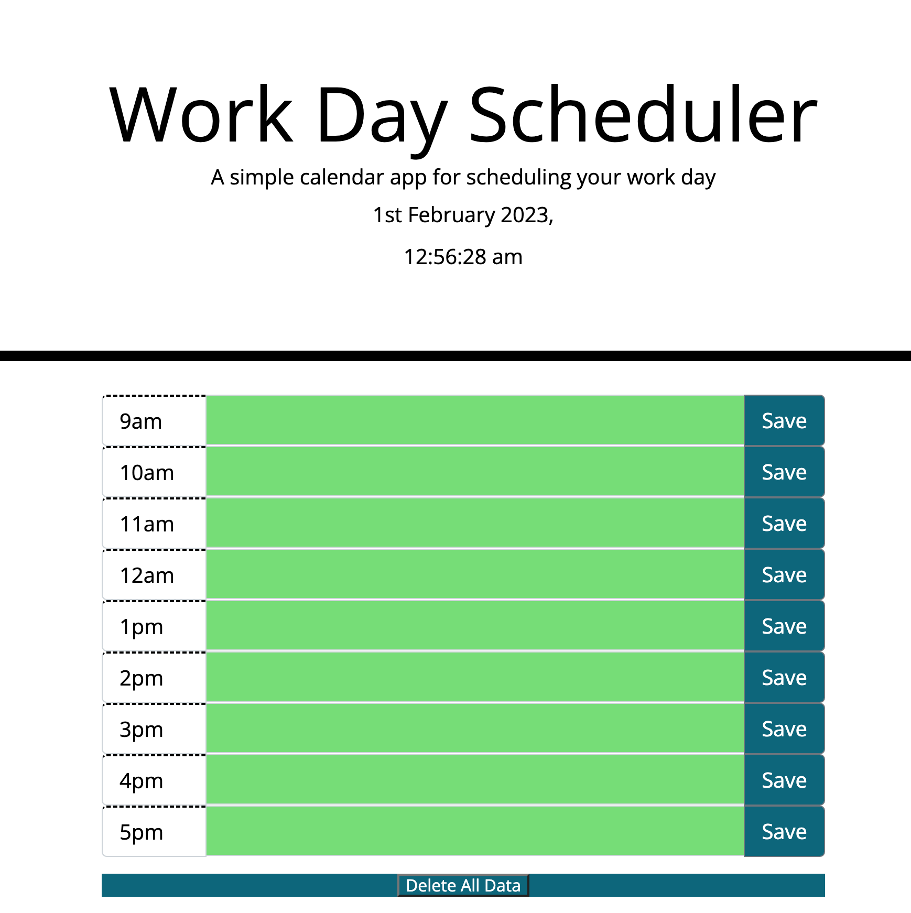

# Work-Day-Scheduler

## **Introduction**

A simple calendar app for scheduling your work day.

## **Description**

The Work Day Scheduler is a single-page web application that allows users to plan their work day. The app displays the current date and time and provides 9 time blocks (from 9am to 5pm) for the user to enter and save events. The time blocks are color-coded to indicate whether the current time is in the past, present, or future.

  

Deployed website: https://antonscheving.github.io/Work-Day-Scheduler/

 

   
Work-Day-Scheduler Screenshot

 

## **Features**

9 time blocks to enter and save events
The current date and time are displayed at the top of the page
Time blocks are color-coded to indicate the current time: past events are gray, the present time block is red, and future time blocks are green
User inputs are saved to local storage, so events persist even after the page is reloaded
Technical Details

The Work Day Scheduler is built with HTML, CSS, and JavaScript. The following libraries and tools were used:

* Bootstrap 4.3.1
* Font Awesome 5.8.1
* jQuery 3.5.1
* Moment.js 2.27.0
 

## **How to Use**

To use the Work Day Scheduler, simply enter an event in each time block and click the save button. The events will be saved to local storage and persist even after the page is reloaded.
 

## **Prerequisites**

A web browser is required to run this code.

 
 

## **Credits**

Front-end web developer: Anton Scheving 
<strong><a href="https://github.com/AntonScheving">GitHub</a></strong>

<strong><a href="https://www.linkedin.com/in/antonscheving/">Linkedin</a></strong>

<strong><a href="https://www.antonscheinvg.com/">AntonScheving.com</a></strong>

 
## **License**

MIT License

Copyright (c) 2023 Anton Scheving

Permission is hereby granted, free of charge, to any person obtaining a copy
of this software and associated documentation files (the "Software"), to deal
in the Software without restriction, including without limitation the rights
to use, copy, modify, merge, publish, distribute, sublicense, and/or sell
copies of the Software, and to permit persons to whom the Software is
furnished to do so, subject to the following conditions:

The above copyright notice and this permission notice shall be included in all
copies or substantial portions of the Software.

THE SOFTWARE IS PROVIDED "AS IS", WITHOUT WARRANTY OF ANY KIND, EXPRESS OR
IMPLIED, INCLUDING BUT NOT LIMITED TO THE WARRANTIES OF MERCHANTABILITY,
FITNESS FOR A PARTICULAR PURPOSE AND NONINFRINGEMENT. IN NO EVENT SHALL THE
AUTHORS OR COPYRIGHT HOLDERS BE LIABLE FOR ANY CLAIM, DAMAGES OR OTHER
LIABILITY, WHETHER IN AN ACTION OF CONTRACT, TORT OR OTHERWISE, ARISING FROM,
OUT OF OR IN CONNECTION WITH THE SOFTWARE OR THE USE OR OTHER DEALINGS IN THE
SOFTWARE.

---
© 2023 Confidential and Proprietary. All Rights Reserved.